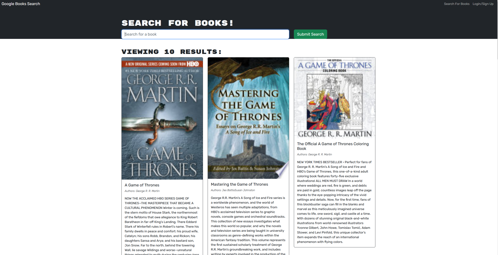

# Book finder

## Description
This is a simple MERN application that allows users to login, signup, search for books and save books. The application uses GraphQl and Apollo with Mongo db for the backend and React for the front end.

## Demo

A link to the deployed application can be found [here](https://book-search-engine-101.herokuapp.com/)

